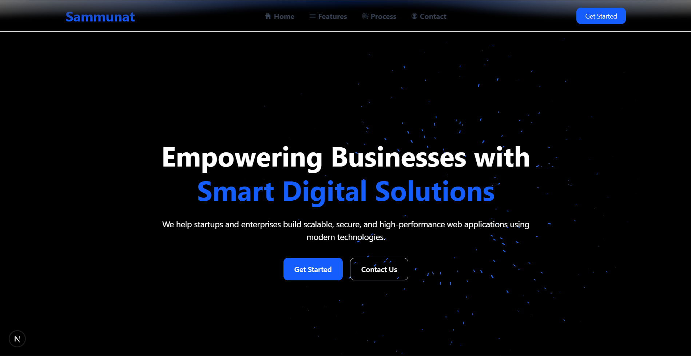
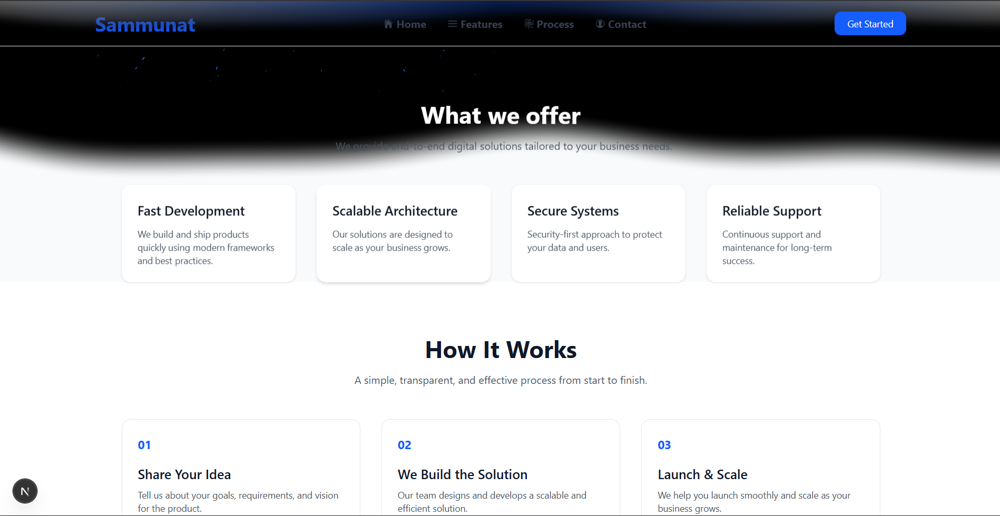
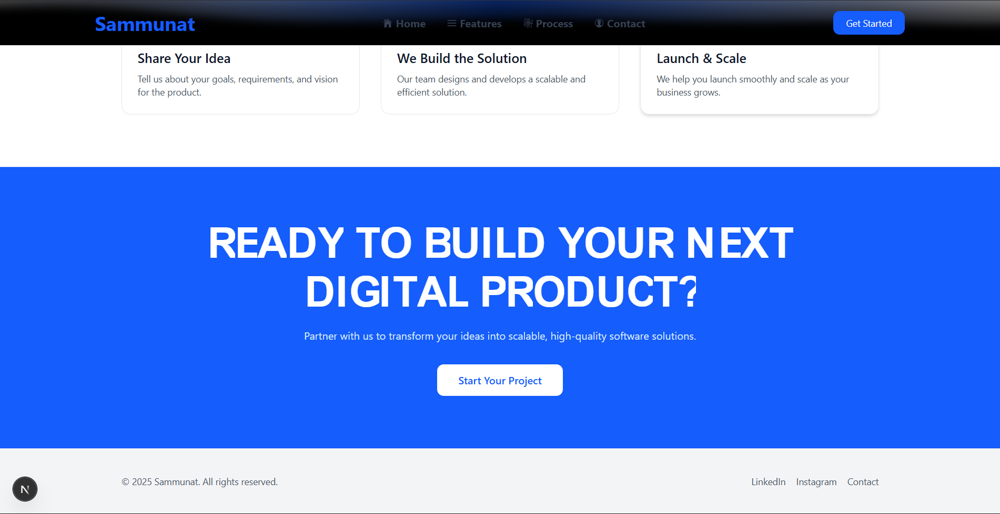

# Sammunat Landing Page

A modern, responsive landing page built using **Next.js** and **Tailwind CSS**, designed to showcase a clean UI, smooth animations, and best frontend practices.

The project includes interactive visual effects powered by **react-bits** to enhance user experience while keeping performance and readability in mind.

---

## ✨ Features

- Modern and minimal landing page design
- Responsive layout (mobile-first)
- Reusable component-based architecture
- Interactive animated background using `react-bits`
- Clean typography and spacing
- Optimized for performance and accessibility

---

## 🛠 Tech Stack

- **Next.js** (App Router)
- **React**
- **TypeScript**
- **Tailwind CSS**
- **react-bits** (for visual effects & animations)
- **Vercel** (deployment)

---
## Screenshots





## ⚙️ Getting Started (Local Setup)

```bash
npm install
npm run dev
```
Open http://localhost:3000 in your browser.

## 🎯 Purpose
This project was created as part of a frontend internship assignment to demonstrate:

React & Next.js fundamentals

Clean UI/UX implementation

Component reusability

Deployment workflow

## 👤 Author
Sahil Salap<br>
sahilsalap75@gmail.com